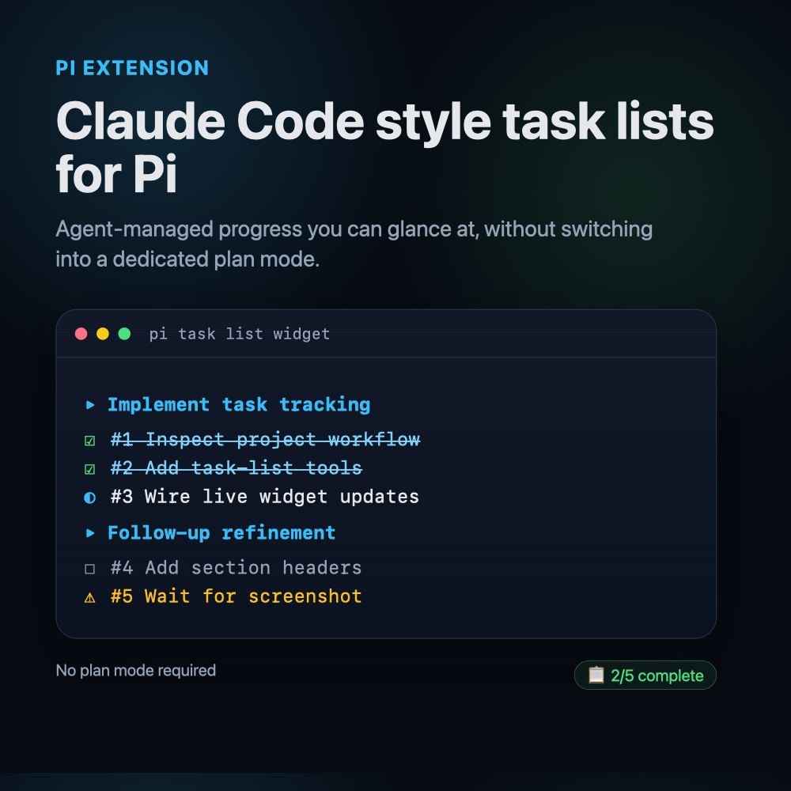

# Pi Task List

Intent: Claude Code style task lists for Pi, implicitly managed by the agent so you can glance at progress without switching into a dedicated plan mode.

Pi Task List adds a session-scoped checklist widget to Pi. The agent creates, updates, and clears tasks when useful for longer work. It works in your normal Pi workflow, including automatic write mode, plan-heavy prompts, debugging loops, and follow-up requests.



## Why use it

- Claude Code style task list inside Pi.
- No special mode required, install the plugin and keep working normally.
- Agent-managed progress: task creation, updates, notes, skipped items, and completed items.
- Live widget and footer status for quick glanceability.
- Long task labels wrap onto continuation lines instead of ending with a truncation ellipsis.
- Long task lists use a rolling widget window around the first unfinished task, with earlier and later hidden task counts.
- Section headers for same-objective follow-up work.
- Session-aware state, resume and branch navigation keep the correct checklist.
- Compaction clears a fully completed task list while preserving unfinished lists and their sections, regardless of trigger.
- Spam control: avoids checklists for simple questions and replaces stale lists instead of appending forever.
- Easy opt-out with `/tasks off`, `/tasks create off`, preset config, or `pi remove`.

## Install

```bash
pi install npm:@thunstack/pi-task-list
```

Try without installing:

```bash
pi -e npm:@thunstack/pi-task-list
```

Install from GitHub before npm publish:

```bash
pi install git:github.com/aashishd/pi-task-tracker
```

## What it adds

Agent tools:

- `task_list_set`: create or replace the active task list.
- `task_list_add`: add same-objective follow-up tasks, optionally under a section header.
- `task_list_update`: mark one task as pending, in progress, done, blocked, or skipped.
- `task_list_get`: read the active list.
- `task_list_clear`: clear obsolete tracking.

Commands:

- `/tasks` or `/tasks status`: show current task list.
- `/tasks adopt`: adopt the latest assistant `Plan:` checklist.
- `/tasks clear`: clear current task list.
- `/tasks off` / `/tasks on`: disable or enable task tracking for this session.
- `/tasks create off` / `/tasks create on`: disable or enable new task-list creation for this session.
- `/todos`: alias for `/tasks`.

## Checklist threshold

The agent is instructed to create a task list only when useful for progress tracking, such as:

- 3+ meaningful steps.
- Multiple files or phases.
- Debugging or research loops.
- Validation passes.
- Subagent workflows.
- Explicit user request for progress tracking.

It should not create a checklist for simple Q&A, quick explanations, one small edit, or one to two obvious actions.

Task labels must contain 3 to 15 whitespace-separated words. Extra detail belongs in short update notes when needed.

## Follow-up behavior

- New unrelated objective: replace the active list with `task_list_set` instead of appending.
- Same objective, new phase: add tasks with `task_list_add` and `sectionTitle` so the UI shows a new header.
- At most two follow-up lists may be added to one active list. A third `task_list_add` call clears the list instead.
- Completed list: do not append by default. Start a fresh list unless the user clearly extends the same objective.

## Disable or tune

Temporary session controls:

```bash
/tasks off
/tasks create off
/tasks clear
```

Preset-level config in `presets.json`:

```json
{
  "plan": {
    "taskTracker": {
      "enabled": true,
      "create": true,
      "execute": false,
      "autoAdopt": false,
      "promptToAdopt": true,
      "showWidget": true
    }
  },
  "chat": {
    "taskTracker": false
  }
}
```

Options:

- `enabled`: activate task-list tools and prompt context for this preset.
- `create`: allow the agent or detected plans to create new task lists and new task items.
- `execute`: allow progress updates with `task_list_update` in this preset.
- `autoAdopt`: adopt detected `Plan:` checklists without asking.
- `promptToAdopt`: ask before adopting detected `Plan:` checklists.
- `showWidget`: show or hide the live checklist widget.

Uninstall:

```bash
pi remove npm:@thunstack/pi-task-list
```

## Attribution

See `NOTICE.md` for upstream attribution to Pi's official `plan-mode` example and its contributors.

## License

MIT
